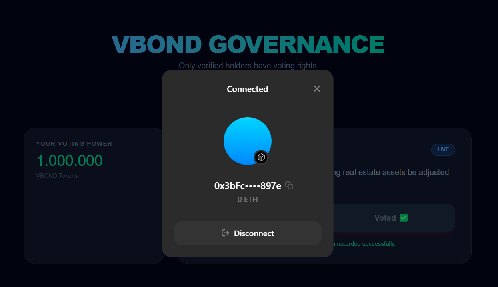
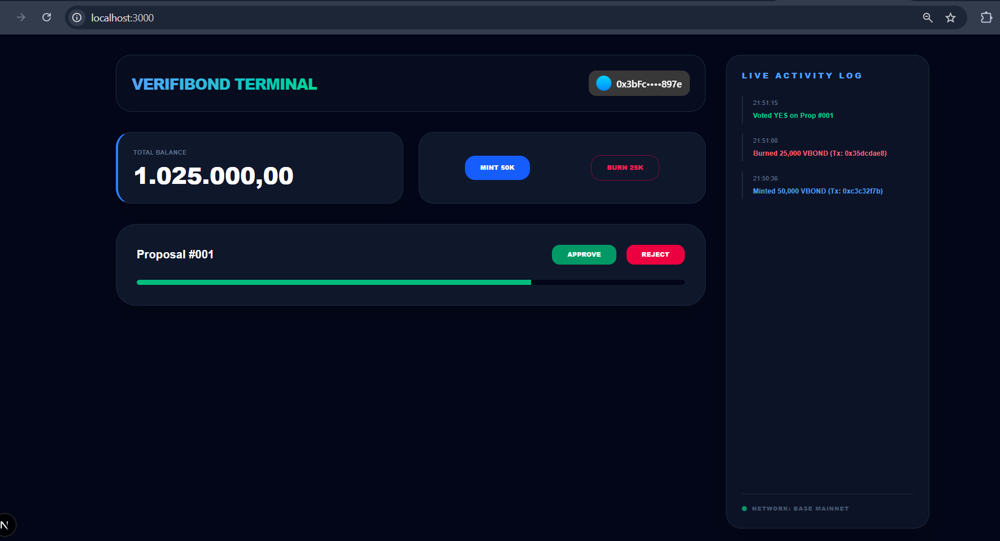
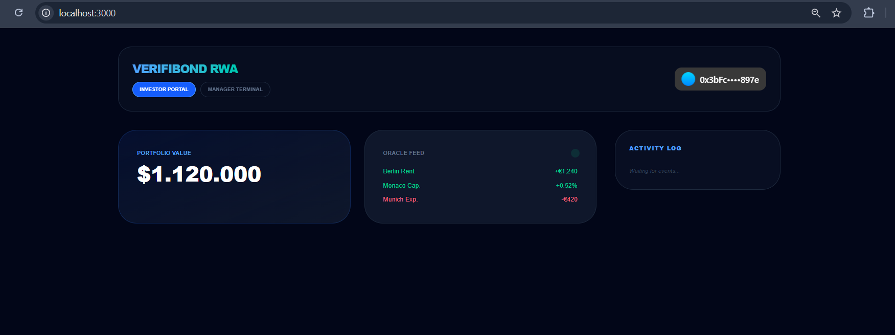

# 🏛️ VerifiBond: RWA Governance Platform

**VerifiBond** is a decentralized Governance and Management platform for tokenized Real World Assets (RWA). It bridges the gap between decentralized finance (DeFi) and institutional real estate investments, providing a professional interface for property fund management and community-led decision-making on the **Base** network.

---

## 🛡️ Smart Contract Verification

For full protocol transparency, the VerifiBond core smart contract can be reviewed and interacted with directly on Etherscan (Sepolia):

### 💎 [View $VBOND Token Contract on Etherscan](https://sepolia.etherscan.io/address/0x17422e601c91a1678faa58dfc5f5381bf15c527e)

---

## 💎 Core Project Pillars

### 1. Decentralized Governance Hub
Empowering token holders to shape the future of the portfolio.
* **Proposal Management:** Vote on critical protocol decisions, such as new property acquisitions or fee adjustments.
* **On-Chain Logic:** Designed for verifiable and tamper-proof governance participation using smart contract voting.

### 2. Strategic Manager Terminal
A specialized environment for Protocol Administrators and Fund Managers.
* **Supply Control:** Real-time **Minting** and **Burning** mechanisms to peg the $VBOND token supply to real-world asset value.
* **Live Activity Log:** A terminal-style sidebar tracking every administrative action with precise timestamps for auditability.

### 3. Investor Performance Portal (Oracle Integration)
A transparent dashboard bridging off-chain data with on-chain transparency.
* **Yield Breakdown:** Real-time data feeds showing rental income (Berlin), capital appreciation (Monaco), and operational costs (Munich).
* **Automated Valuation:** Instant calculation of holdings based on the current Oracle-fed asset performance.

---

## 🛠️ Technical Architecture

* **Framework:** Next.js 14 (App Router)
* **Web3 Stack:** Wagmi hooks, Viem, and ConnectKit for seamless wallet abstraction.
* **Network:** Optimized for **Base L2** (Sepolia) for fast, low-cost transaction finality.
* **UI/UX:** Tailwind CSS with a professional, data-centric "Dark Terminal" aesthetic.

---

## 🌟 Platform Walkthrough

### 1. Connection & Authentication
Access is secured via Web3 wallet integration. The platform detects the connection status to unlock specialized dashboards.

### 2. Main Terminal Overview
The central hub for navigating between different protocol functions.

### 3. Investor Portal & Oracle Data
Investors can track their portfolio value and view real-time yield data.

### 4. Manager Terminal & Supply Control
The command center for fund managers to oversee the 1,025,000
