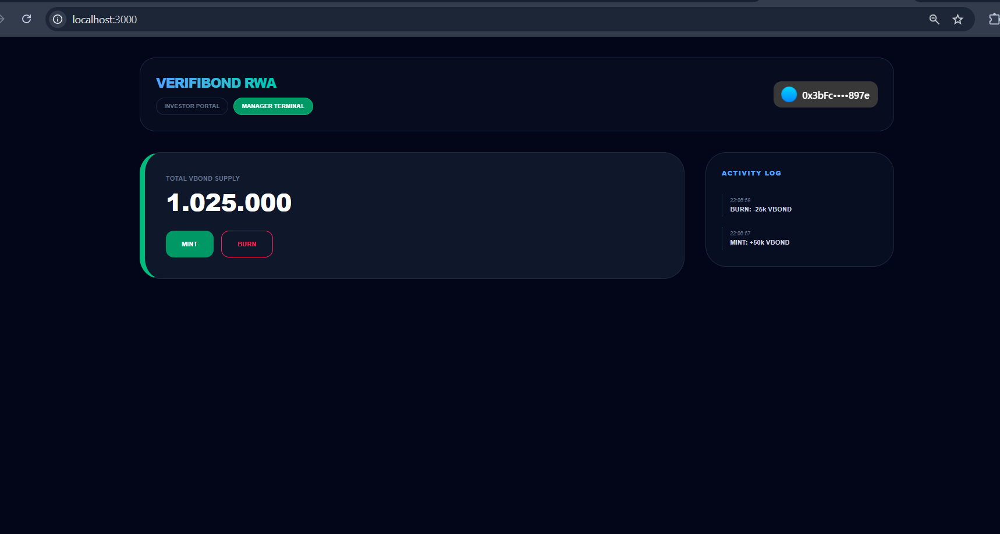
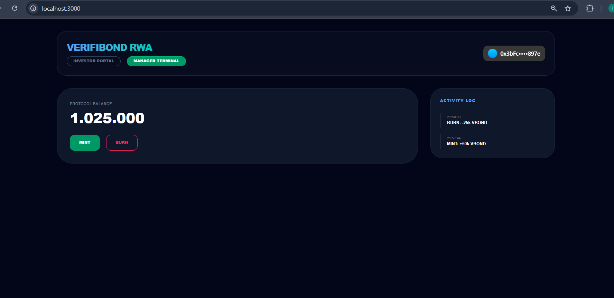
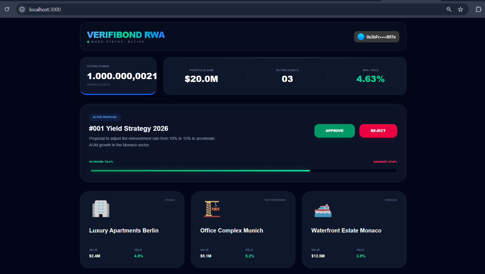
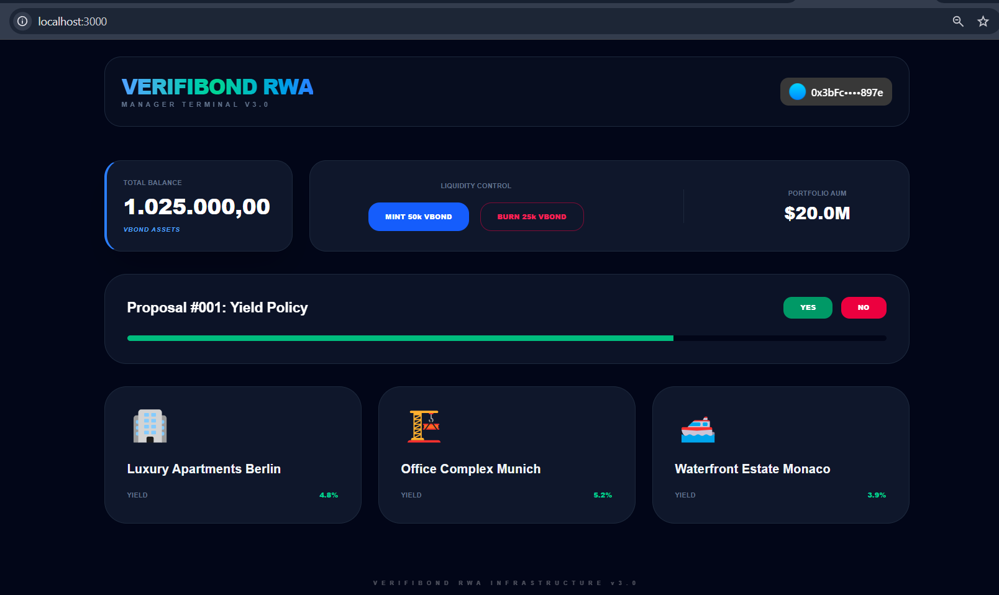
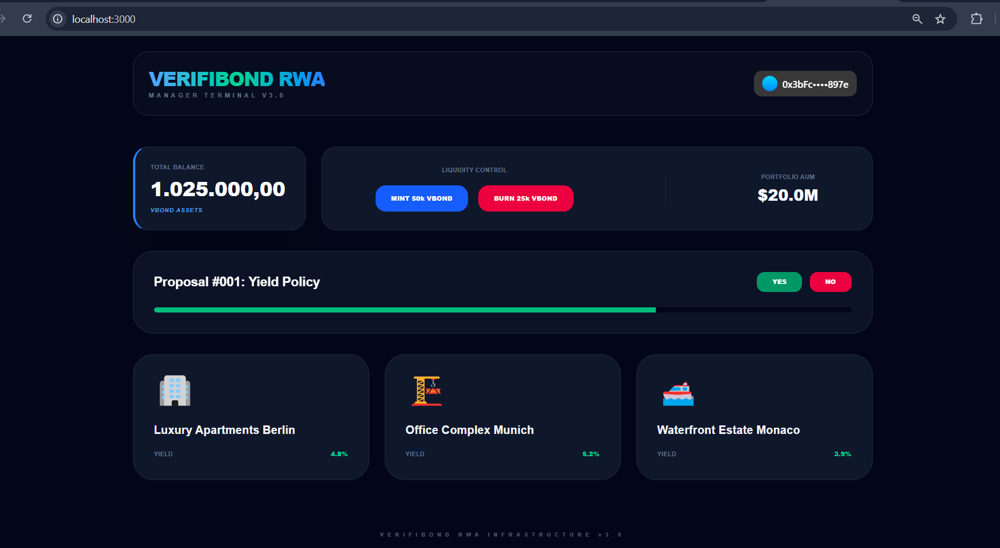

# 🏛️ VerifiBond: RWA Governance Platform

**VerifiBond** is a decentralized Governance and Management platform for tokenized Real World Assets (RWA). It provides a high-fidelity interface for institutional-grade property management, liquidity control, and community-led decision-making on the **Base** network.

---

## 🛡️ Smart Contract Verification

For full protocol transparency, the VerifiBond core smart contract can be reviewed and interacted with directly on Etherscan (Sepolia):

### 💎 [View $VBOND Token Contract on Etherscan](https://sepolia.etherscan.io/address/0x17422e601c91a1678faa58dfc5f5381bf15c527e)

---

## 🌟 Platform Walkthrough

### 1. Connection & Authentication
Access is secured via Web3 wallet integration.

### 2. Main Terminal Overview
The central hub for navigating protocol functions.

### 3. Investor Portal & Oracle Data
Real-time yield data provided by our Oracle layer, covering assets in Berlin, Monaco, and Munich.

### 4. Manager Terminal & Supply Control
The command center for fund managers to oversee the 1,025,000 VBOND supply.

#### Mint & Burn Logic

---

### 5. Decentralized Governance Hub
Token holders participate in decision-making by voting on active proposals.

#### Proposal Management & Voting

  
  

